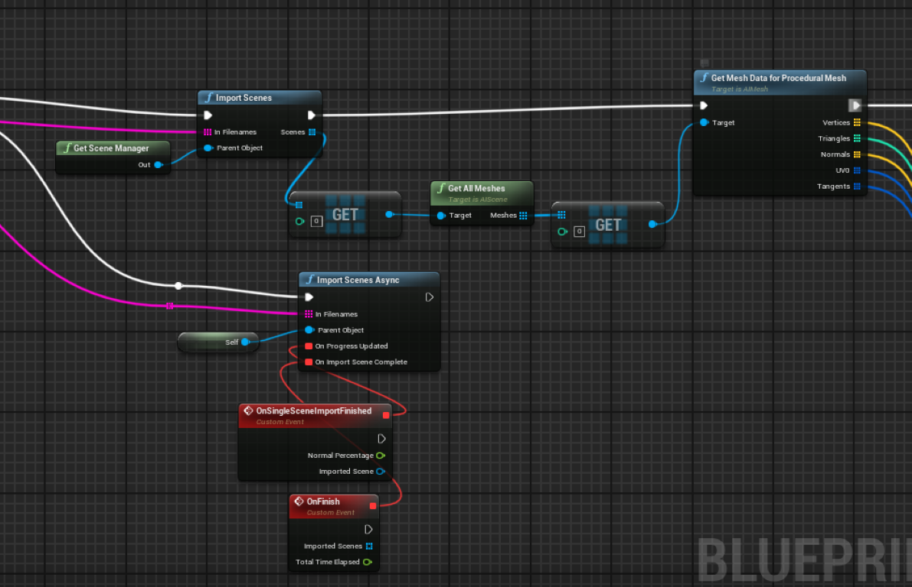

 
# Assimp Mesh Importer  5.4.2 for  Unreal engine 
### Features:

- Static Mesh and Procedural Mesh support  
- Mesh instancing for Static Meshes
- Async Loading
- Users can use multpile approaches for maximum flexiblity
- Garbage collection using unreal GC and integration with UObjects 
- Embedded Texture import 
- Supports 57 different file formats for reading
- Supports auto generating missing data such as normals

|             |  |
:-------------------------:|:-------------------------:
  |  
---

### Experimental features:

- Dynamic Mesh support from UE 5.0 onwards, which are faster than Static Mesh and Procedural Mesh
  - [Docs](https://github.com/902D9/AssimpForUnreal/wiki/Dynamic-Mesh)
- Use AssimpImporter for asynchronous imports
  - [Docs](https://github.com/902D9/AssimpForUnreal/wiki/Assimp-Importer-(Async))

## Docs  :  
For instructions about how to use visit : [Docs](https://github.com/irajsb/UE4_Assimp/wiki)

